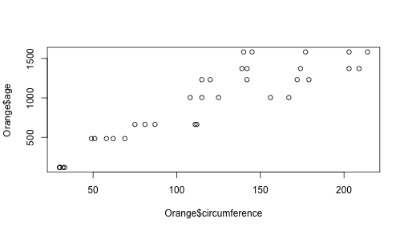

## About This Project

In this project, Rstudio is used to make a Shiny App. 

The project is for Coursera's [Developing Data Products](https://www.coursera.org/learn/data-products) course. 

---

## About The Shiny App

The Shiny App predicts the age of an orange tree, based on the tree trunk's circumference. 

The dataset [Orange](https://stat.ethz.ch/R-manual/R-devel/library/datasets/html/Orange.html) in the R datasets package contains circumference measurements over time for five orange trees. Here is a look at the dataset:


```r
head(Orange)
```

```
##   Tree  age circumference
## 1    1  118            30
## 2    1  484            58
## 3    1  664            87
## 4    1 1004           115
## 5    1 1231           120
## 6    1 1372           142
```

---

## How to use the App

To predict the age of your orange tree, measure its circumference in millimeters. Then enter that number into the slider in the App. 

Model 3 uses the data from all five trees, shown in this plot, and is probably the best model.


```r
plot(Orange$circumference, Orange$age)
```



---

## Where to Find the App

The App is here: (https://byanyothername.shinyapps.io/orange/)

And the code is here: (https://github.com/greenandgold/Orange)

Enjoy!


